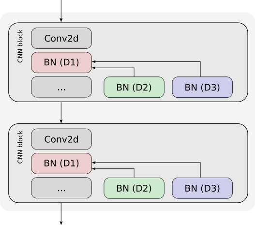

This repository contains the baseline code for DCASE 2026 Task 7, Domain-Agnostic Incremental Learning for Audio Classification.
Participants can build their own systems by extending the provided baseline system. 

## System description
<p align="justify"> The baseline system includes 6 convolutional blocks. Each block includes 2 convolutional layers, each convolutional layer followed by a batch normalization (BN) layer, with the layer specifications the same as PANNs CNN14.  Global pooling is applied to the last convolutional layer, to get a fixed-length input feature vector to the classifier. The baseline model is trained from scratch on the domain D1, then separate domain-specific BN layers are adapted for domain D2 and D3 in incremental phases. 
</p>



<p align="justify">During inference, domain-specific BN layers are predicted and used with domain-shared layers for classification. Specifically, an input audio is forward passed through a combination of shared and domain-specific layers of each domain seen so far and obtains the class probabilities. Subsequently, uncertainty of the model on given input audio among the predicted probabilities is computed using entropy. The domain-specific layers which have minimum entropy, denoting lower uncertainty, are selected for classification.
</p>

## Requirements

To install requirements:

```setup
pip install -r requirements.txt
```
## Data and Features 

* Download the development dataset from the [Zenodo](https://zenodo.org/records/19335184).
* Prepare the dataset in a format that enables the baseline system to correctly read and process the input audio files. The dataset structure should be:
```text
task7_data/
├── audio
└── evaluation_setup ├── development_train.txt
                     └── development_test.txt
```
* Update the path of meta files (development_train.txt and development_test.txt) in the [config_task7](utils/config_task7.py) file.
* Both development_train.txt and development_test.txt include: file-name, class, domain-id and label:
```text
audio/00333.wav	alarm	D2	0
audio/00334.wav	alarm	D2	0
audio/00335.wav	alarm	D2	0
audio/07671.wav	speech	D3	9
audio/07672.wav	speech	D3	9
audio/07673.wav	speech	D3	9
```
* Labels for corresponding sounds are listed in [config_task7](utils/config_task7.py).
* We segmented the audios in development train into 4-second signals for training the baseline system in batches using [chunking](utils/chunking.py). The testing samples have variable lengths. During inference, we predict the class label per audio file. 
* Log mel-band energies are obtained from sounds using [torchlibrosa](https://github.com/qiuqiangkong/torchlibrosa) library.
* The baseline system writes the output.txt file to the output_folder path specified in [config_task7](utils/config_task7.py).

## Checkpoints
The development data of the domain D1 is not available. However, the pre-trained models on D1 (checkpoint_D1.pth), D2 (checkpoint_D2.pth) and D3 (checkpoint_D3.pth) can be downloaded from [here](https://drive.google.com/drive/folders/1C21s1KlN4ZbnboIdtO8H0T-S0_k8yw3o?usp=sharing).  Store all the checkpoints in a folder 'checkpoints/BN/' or updated the 'save_resume_path' in [config_task7](utils/config_task7.py) to check the results of the baseline system on development test set.


#### Training and evaluation
To train the baseline (domain-specific BN layers) from scratch on D2 and D3:
```
python baseline/baseline_DIL_task7.py train --augmentation='none' --learning_rate=1e-4 --batch_size=32 --cuda --num_workers 16 --epoch 120 --save
```
To test the baseline performance on D2 and D3 using pre-trained model checkpoints:
```
python baseline/baseline_DIL_task7.py train --augmentation='none' --learning_rate=1e-4 --batch_size=32 --cuda --num_workers 16 --epoch 120 --resume
```
## Parameters
#### Acoustic features
- Sampling rate:  32 kHz
- Training samples in the development set are segmented into 4-second signals, while the testing samples have variable lengths.
- Log mel-band energies (64 bands) with lower and upper cut-off frequencies 50 Hz and 14 kHz respectively. The window (Hamming) size is set to 1024 samples  and hop size to 320 samples. 
#### Neural network
- Architecture
  - CNN block #1:  
    - 2 x [2D Convolutional layer (filters: 64, kernel size: 3) + 3 Batch normalization layers (D1, D2 and D3) + ReLu], 2 x 2 average pooling + Dropout (rate: 20%)
  - CNN block #2:  
    - 2 x [2D Convolutional layer (filters: 128, kernel size: 3) + 3 Batch normalization layers (D1, D2 and D3) + ReLu], 2 x 2 average pooling + Dropout (rate: 20%)
  - CNN block #3:  
    - 2 x [2D Convolutional layer (filters: 256, kernel size: 3) + 3 Batch normalization layers (D1, D2 and D3) + ReLu], 2 x 2 average pooling + Dropout (rate: 20%)
  - CNN block #4:  
    - 2 x [2D Convolutional layer (filters: 512, kernel size: 3) + 3 Batch normalization layers (D1, D2 and D3) + ReLu], 2 x 2 average pooling + Dropout (rate: 20%)
  - CNN block #5:  
    - 2 x [2D Convolutional layer (filters: 1024, kernel size: 3) + 3 Batch normalization layers (D1, D2 and D3) + ReLu], 2 x 2 average pooling + Dropout (rate: 20%)
  - CNN block #6:  
    - 2 x [2D Convolutional layer (filters: 2048, kernel size: 3) + 3 Batch normalization layers (D1, D2 and D3) + ReLu], 2 x 2 average pooling + Dropout (rate: 20%)
  - Global pooling
  - Output layer (activation: softmax)
- Learning: 120 epochs (batch size 32), data shuffling between epochs
- Optimizer: Adam (learning rate at initial phase: 0.0001, at incremental phases: 0.00001)
- Scheduler: CosineAnnealingLR

## Results for the development dataset:

Results of baseline are calculated using PyTorch in GPU mode . The baseline is trained for 120 epochs and tested on the test split of the development dataset.
<table class="dataset-table">
  <thead>   
  </thead>
  <tbody>
    <tr>
      <td>D3</td>
      <td></td>
      <td>35.0</td>
    </tr>
    <tr>
      <td>D2</td>
      <td>54.7</td>
      <td>54.7</td>
    </tr>
    <tr>
      <td>Average accuracy</td>
      <td>54.7</td>
      <td>44.8</td>
    </tr>
    
  </tbody>
</table>

The baseline model first learns to classify sounds from domain D2, obtains an accuracy of 54.7% on D2 data. Then, it incrementally learns domain D3 and obtains an accuracy of 35.0% on D3. 
The average accuracy of the baseline model on D2 and D3 is 44.8%. 
D1 results will be included in the overall average after the challenge deadline. 


Note: The reported baseline system performance is not exactly reproducible due to varying setups. However, you should be able to obtain very similar results.


## Citation
If you are using the baseline system, please cite the following: 

```BibTeX
@INPROCEEDINGS{10890481,
  author={Manjunath Mulimani and Annamaria Mesaros},
  booktitle={IEEE International Conference on Acoustics, Speech and Signal Processing (ICASSP)}, 
  title={Domain-Incremental Learning for Audio Classification}, 
  year={2025}, 
  pages={1-5}
  }
```